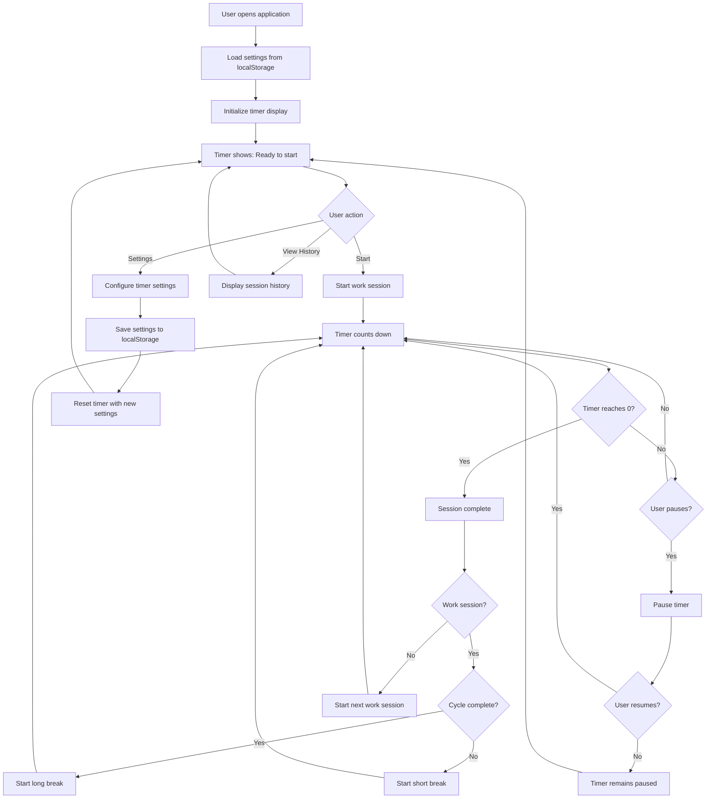
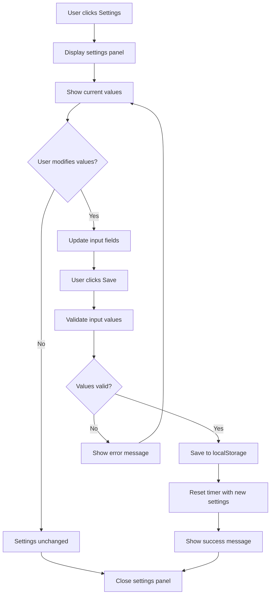
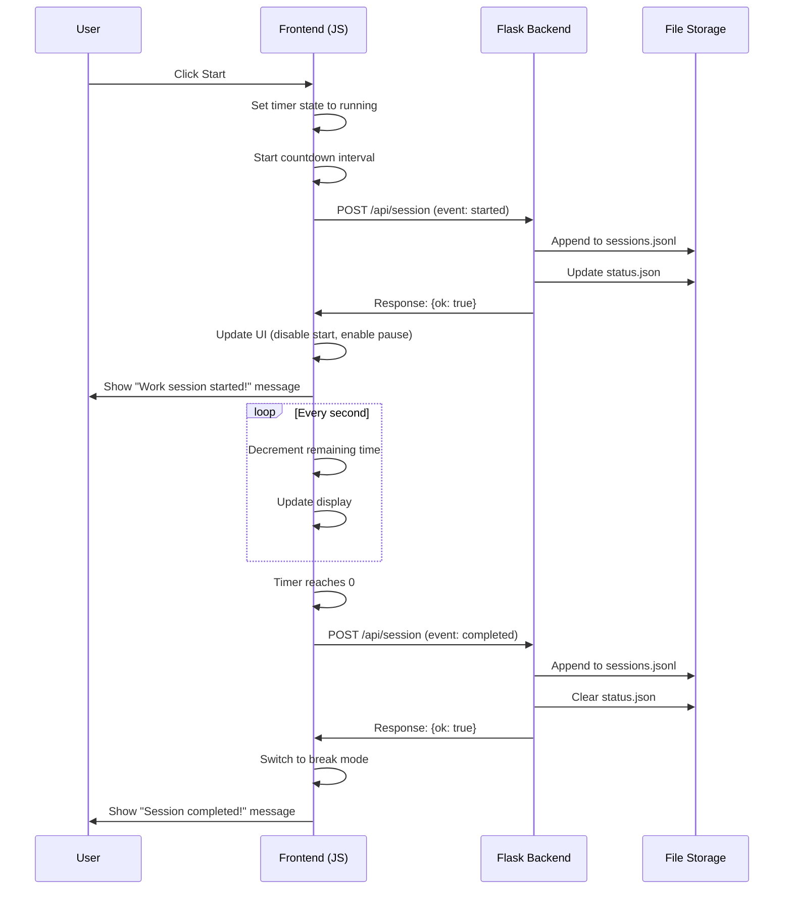
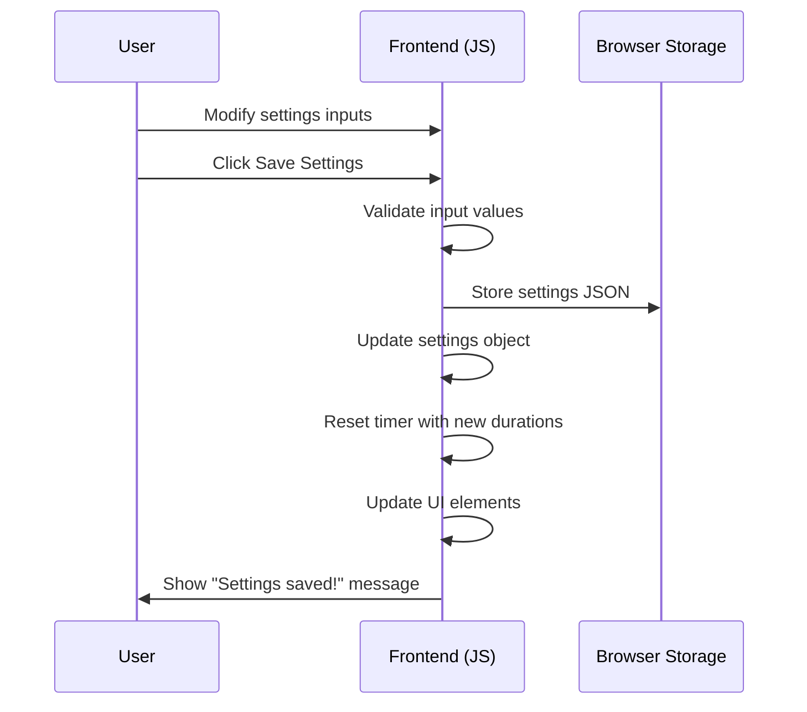
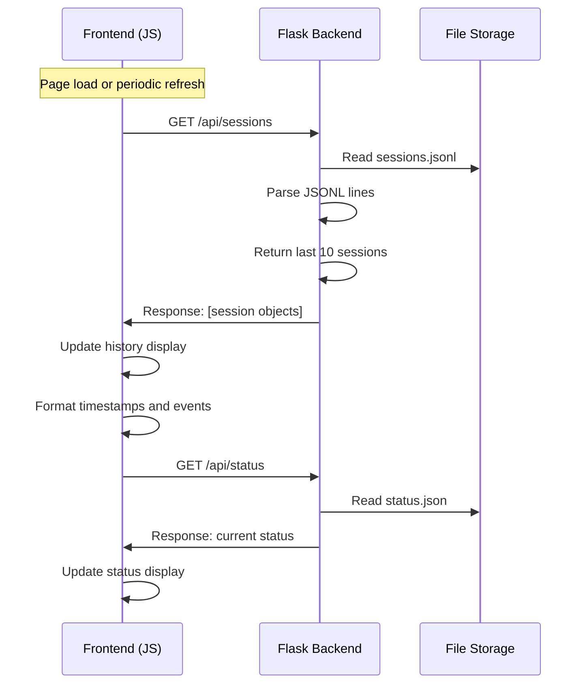
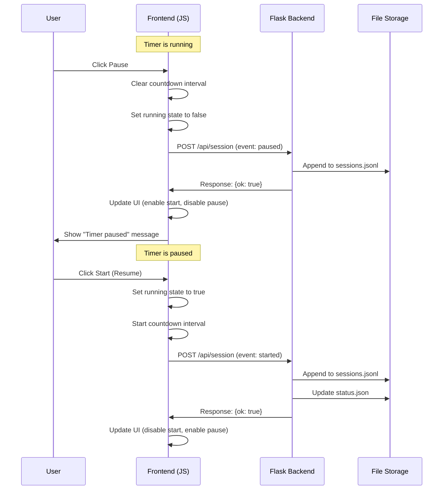

# Pomodoro Timer Application Documentation

## Overview

The Pomodoro Timer is a web-based productivity application that implements the Pomodoro Technique for time management. The application follows a client-server architecture with a browser-based frontend and a Flask backend for session tracking and persistence.

## Architecture

### Frontend
- **Technology**: HTML5, CSS3, JavaScript (Vanilla)
- **Responsibility**: Timer logic, UI controls, user settings, session management
- **Components**:
  - Timer display and controls
  - Settings configuration
  - Status display
  - Session history viewer

### Backend
- **Technology**: Flask (Python)
- **Responsibility**: Session logging, data persistence, API endpoints
- **Components**:
  - Storage system for session data
  - REST API endpoints
  - Static file serving

### Data Persistence
- **Sessions Log**: `logs/sessions.jsonl` - Append-only JSONL file for all events
- **Status File**: `logs/status.json` - Current session state (atomic writes)
- **Client Settings**: Browser localStorage for user preferences

## Core Features

### Timer Functionality
- **Work Sessions**: Configurable duration (default: 25 minutes)
- **Short Breaks**: Between work sessions (default: 5 minutes)  
- **Long Breaks**: After completing a cycle (default: 15 minutes)
- **Cycle Management**: Configurable number of work sessions before long break (default: 4)

### Controls
- **Start**: Begin timer countdown
- **Pause**: Pause current session
- **Reset**: Reset timer to initial state
- **Skip**: Skip current session and move to next

### Settings
- Customizable durations for work, short break, and long break
- Configurable cycle count before long break
- Settings persist in browser localStorage

### Logging & Tracking
- All timer events logged to server
- Session history display
- Current status tracking

## User Flow Charts

### Main User Flow



### Settings Flow



## Sequence Diagrams

### Timer Start Sequence



### Settings Update Sequence



### Session History Loading Sequence



### Pause/Resume Sequence



## API Documentation

### Endpoints

#### `GET /`
- **Description**: Serves the main application page
- **Response**: HTML page with timer interface

#### `POST /api/session`
- **Description**: Log a timer event
- **Request Body**:
  ```json
  {
    "event": "started|paused|completed|skipped|reset",
    "meta": {
      "type": "work|shortBreak|longBreak",
      "cycle": 1,
      "duration": 1500,
      "remaining": 900
    },
    "set_status": {
      "running": true,
      "type": "work",
      "cycle": 1
    }
  }
  ```
- **Response**: `{"ok": true}` (201 status)
- **Actions**: 
  - Appends event to sessions.jsonl
  - Updates status.json if `set_status` provided

#### `GET /api/sessions`
- **Description**: Retrieve session history
- **Response**: Array of session objects
- **Example**:
  ```json
  [
    {
      "timestamp": "2025-11-28T12:34:56Z",
      "event": "started",
      "meta": {
        "type": "work",
        "cycle": 1,
        "duration": 0
      }
    }
  ]
  ```

#### `GET /api/status`
- **Description**: Get current timer status
- **Response**: Current status object or empty object
- **Example**:
  ```json
  {
    "running": true,
    "type": "work",
    "cycle": 1
  }
  ```

## Data Models

### Session Event Structure
```json
{
  "timestamp": "2025-11-28T12:34:56Z",
  "event": "started|paused|completed|skipped|reset",
  "meta": {
    "type": "work|shortBreak|longBreak",
    "cycle": 1,
    "duration": 1500,
    "remaining": 900
  }
}
```

### Status Structure
```json
{
  "running": true,
  "type": "work|shortBreak|longBreak", 
  "cycle": 1
}
```

### Settings Structure (localStorage)
```json
{
  "workDuration": 25,
  "shortBreak": 5,
  "longBreak": 15,
  "cyclesUntilLong": 4
}
```

## File Structure

```
├── app.py                 # Flask application and API endpoints
├── requirements.txt       # Python dependencies
├── logs/
│   ├── sessions.jsonl    # Append-only session events log
│   └── status.json       # Current session status
├── static/
│   ├── css/
│   │   └── styles.css    # Application styling
│   └── js/
│       └── timer.js      # Frontend timer logic
├── templates/
│   └── index.html        # Main application template
└── tests/
    └── test_app.py       # Unit tests
```

## State Management

### Frontend Timer State
- `running`: Boolean indicating if timer is active
- `currentType`: Current session type (work/shortBreak/longBreak)
- `currentCycle`: Current cycle number within the set
- `remaining`: Remaining seconds in current session
- `intervalId`: JavaScript interval ID for countdown

### Backend Storage
- **Thread-safe**: Uses file locking for concurrent access
- **Atomic writes**: Status updates use temporary file + rename
- **Append-only logs**: Sessions logged to JSONL for durability

## Error Handling

### Frontend
- API call failures logged to console
- Graceful degradation when backend unavailable
- Input validation for settings
- localStorage fallback handling

### Backend
- JSON parsing error handling
- File I/O error recovery
- Invalid request validation
- Thread-safe file operations

## Browser Compatibility

- Modern browsers supporting ES6+
- localStorage API required
- Fetch API for HTTP requests
- No external JavaScript dependencies

## Development Notes

### Testing
- Unit tests for Flask API endpoints
- Test coverage for storage operations
- Mock localStorage for testing

### Deployment Considerations
- Ensure logs directory is writable
- Consider log rotation for long-term usage
- Static file serving can be handled by web server
- Thread-safe storage implementation handles concurrent users

### Future Enhancements
- User authentication and multi-user support
- Statistics and analytics dashboard
- Audio notifications
- Mobile app version
- Data export functionality